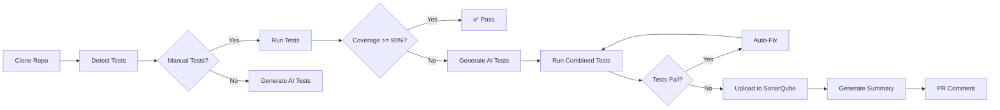

# AI TestGen - Intelligent Test Generation & Coverage Gating

[](https://github.com/Tejas4560/Tech_Demo/actions)
[](https://www.python.org/)
[](https://github.com/Tejas4560/Tech_Demo)
[](LICENSE)

**AI-powered test generation pipeline** that analyzes your code, generates meaningful tests, measures coverage, and gates CI/CD pipelines—all with clear, auditable outputs.

---

## 🚀 Quick Start

### Prerequisites
- Python 3.9+
- GitHub repository
- LLM API access (OpenAI, Groq, or Ollama)

### Basic Usage

1. **Add to your GitHub repository**:
```yaml
# .github/workflows/ai-testgen.yml
name: AI Test Generation

on:
  workflow_dispatch:
    inputs:
      repo_url:
        description: 'Repository URL to test'
        required: true
      min_coverage:
        description: 'Minimum coverage threshold'
        default: '90'

jobs:
  test:
    uses: Tejas4560/Tech_Demo/.github/workflows/ai-test-pipeline.yml@TEST2
    with:
      repo_url: ${{ inputs.repo_url }}
      repo_branch: main
      min_coverage: ${{ inputs.min_coverage }}
    secrets:
      AZURE_OPENAI_API_KEY: ${{ secrets.AZURE_OPENAI_API_KEY }}
      GROQ_API_KEY: ${{ secrets.GROQ_API_KEY }}
```

2. **Run the workflow**:
   - Go to Actions → AI Test Generation
   - Click "Run workflow"
   - Enter your repository URL
   - Set coverage threshold (default: 90%)

3. **View results**:
   - Check PR comments for coverage metrics
   - Download `summary.json` from artifacts
   - Review generated tests in `tests/generated/`

---

## ✨ Features

### 🤖 AI-Powered Test Generation
- **AST-based analysis** with tree-sitter
- **LLM integration** (OpenAI, Groq, Ollama)
- **Gap-aware generation** - focuses on uncovered code
- **Framework support** - FastAPI, Flask, Django

### 📊 Coverage Analysis & Gating
- **Coverage threshold enforcement** (default: 90%)
- **Delta tracking** - before/after comparison
- **Gap identification** - pinpoints uncovered functions
- **SonarQube integration** - enterprise quality gates

### 🔧 Auto-Fix Failing Tests
- **AST-based patching** - precise code modifications
- **LLM-powered classification** - distinguishes test bugs from code bugs
- **Iterative fixing** - up to 3 iterations
- **Smart detection** - import errors, fixture issues, assertion problems

### 💬 PR Comments & Reporting
- **Automatic PR comments** with coverage metrics
- **Sticky comments** - updates same comment (no spam)
- **JSON summary** - comprehensive metrics in one file
- **Rich formatting** - tables, emojis, links

---

## 📋 How It Works



### Pipeline Flow

1. **Clone & Analyze** - Clones target repo and analyzes code structure
2. **Detect Tests** - Finds existing manual tests
3. **Run Tests** - Executes tests with coverage analysis
4. **Coverage Check** - Validates against threshold (default: 90%)
5. **AI Generation** - Generates tests for coverage gaps (if needed)
6. **Auto-Fix** - Fixes failing tests automatically
7. **Report** - Uploads to SonarQube, generates summary, posts PR comment

---

## 🎯 Use Cases

### 1. **CI/CD Quality Gates**
Enforce coverage thresholds before merging:
```yaml
- name: Run AI TestGen
  uses: Tejas4560/Tech_Demo/.github/workflows/ai-test-pipeline.yml@TEST2
  with:
    min_coverage: 90
```

### 2. **Legacy Code Coverage**
Generate tests for untested code:
```bash
python -m src.gen --target /path/to/legacy/code --outdir tests/generated
```

### 3. **Test Maintenance**
Auto-fix failing tests after refactoring:
```bash
python run_auto_fixer.py --test-dir tests --max-iterations 3
```

---

## 📖 Configuration

### Workflow Inputs

| Input | Description | Default | Required |
|-------|-------------|---------|----------|
| `repo_url` | Git repository URL | - | ✅ |
| `repo_branch` | Branch to test | `main` | ❌ |
| `min_coverage` | Minimum coverage % | `90` | ❌ |
| `sonar_project_key` | SonarQube project key | Auto-generated | ❌ |
| `sonar_project_name` | SonarQube project name | Auto-generated | ❌ |

### Environment Variables

| Variable | Description | Required |
|----------|-------------|----------|
| `AZURE_OPENAI_API_KEY` | Azure OpenAI API key | One of these |
| `GROQ_API_KEY` | Groq API key | One of these |
| `OLLAMA_HOST` | Ollama server URL | One of these |
| `SONAR_HOST_URL` | SonarQube server URL | For SonarQube |
| `SONAR_TOKEN` | SonarQube auth token | For SonarQube |
| `GIT_PUSH_TOKEN` | GitHub token for pushing | For auto-commit |

### Example `.env` File

```bash
# LLM Provider (choose one)
GROQ_API_KEY=your-groq-api-key
# AZURE_OPENAI_API_KEY=your-azure-key
# OLLAMA_HOST=http://localhost:11434

# SonarQube (optional)
SONAR_HOST_URL=http://localhost:9000
SONAR_TOKEN=your-sonar-token

# Git Push (optional)
GIT_PUSH_TOKEN=ghp_your_github_token
```

---

## 📊 Outputs

### PR Comment
Automatic comment on pull requests with:
- Coverage metrics (before/after/delta)
- Test results (passed/failed)
- Links to artifacts and logs

Example:
```markdown
## 🤖 AI TestGen Results

### 📊 Coverage Metrics
| Metric | Value |
|--------|-------|
| Coverage After | 99.37% |
| Coverage Before | 75.0% |
| Coverage Delta | +24.37 pp |

### 🧪 Test Results
| Metric | Value |
|--------|-------|
| Generated Tests | 15 files |
| Tests Passed | 142 |
| Tests Failed | 0 |
```

### summary.json
Comprehensive JSON with all metrics:
```json
{
  "generated_at": "2026-01-29T10:14:14Z",
  "status": "success",
  "coverage": {
    "line_coverage": 99.37,
    "branch_coverage": 88.89
  },
  "tests": {
    "manual": {"found": true, "count": 5},
    "generated": {"count": 15},
    "results": {"total": 20, "passed": 20, "failed": 0}
  },
  "summary_text": "Generated 15 tests, coverage 99.4%, 20 passed, 0 failed"
}
```

### Artifacts
- `coverage.xml` - Coverage report
- `test-results.xml` - JUnit test results
- `htmlcov/` - HTML coverage report
- `summary.json` - Comprehensive summary
- `auto_fixer_report.json` - Auto-fixer details
- `coverage_gaps.json` - Uncovered code analysis

---

## 🏗️ Architecture

### Components

```
Tech_Demo_Project_POC/
├── .github/workflows/
│   └── ai-test-pipeline.yml      # Main workflow
├── src/
│   ├── analyzer.py                # AST code analysis
│   ├── coverage_gap_analyzer.py   # Coverage gap detection
│   ├── detect_manual_tests.py     # Test discovery
│   ├── gen/                       # AI test generation
│   │   ├── enhanced_generate.py   # Main generator
│   │   ├── openai_client.py       # OpenAI integration
│   │   ├── groq_client.py         # Groq integration
│   │   └── ollama_client.py       # Ollama integration
│   ├── auto_fixer/                # Auto-fix failing tests
│   │   ├── orchestrator.py        # Fix coordinator
│   │   ├── llm_classifier.py      # Bug classifier
│   │   ├── llm_fixer.py           # Fix generator
│   │   └── ast_patcher.py         # AST-based patching
│   └── framework_handlers/        # Framework-specific logic
│       ├── fastapi_handler.py
│       ├── flask_handler.py
│       └── django_handler.py
├── pipeline_runner.sh             # Main pipeline script
├── generate_summary.py            # Summary generator
└── run_auto_fixer.py             # Auto-fixer CLI
```

### Data Flow

1. **Input** → Repository URL, branch, coverage threshold
2. **Analysis** → AST parsing, test detection, coverage analysis
3. **Generation** → AI-powered test creation for gaps
4. **Execution** → Run tests, measure coverage
5. **Fixing** → Auto-fix failing tests
6. **Reporting** → SonarQube upload, PR comment, summary.json
7. **Output** → Coverage reports, test files, metrics

---

## 🔧 Advanced Usage

### Local Development

```bash
# Clone the repository
git clone https://github.com/Tejas4560/Tech_Demo.git
cd Tech_Demo_Project_POC-main

# Install dependencies
python -m venv venv
source venv/bin/activate
pip install -r requirements.txt

# Set environment variables
cp .env.example .env
# Edit .env with your API keys

# Run pipeline locally
bash pipeline_runner.sh
```

### Generate Tests Only

```bash
python -m src.gen \
  --target /path/to/your/code \
  --outdir tests/generated \
  --force
```

### Auto-Fix Tests Only

```bash
python run_auto_fixer.py \
  --test-dir tests \
  --project-root . \
  --max-iterations 3
```

### Analyze Coverage Gaps

```bash
python src/coverage_gap_analyzer.py \
  --target /path/to/code \
  --current-dir . \
  --output coverage_gaps.json
```

---

## 📚 Examples

### Example 1: FastAPI Project

```yaml
name: Test FastAPI App

on: [push, pull_request]

jobs:
  test:
    uses: Tejas4560/Tech_Demo/.github/workflows/ai-test-pipeline.yml@TEST2
    with:
      repo_url: https://github.com/user/fastapi-app.git
      repo_branch: main
      min_coverage: 85
    secrets:
      GROQ_API_KEY: ${{ secrets.GROQ_API_KEY }}
```

### Example 2: Django Project

```yaml
jobs:
  test:
    uses: Tejas4560/Tech_Demo/.github/workflows/ai-test-pipeline.yml@TEST2
    with:
      repo_url: https://github.com/user/django-app.git
      min_coverage: 90
      sonar_project_key: django-app
    secrets:
      AZURE_OPENAI_API_KEY: ${{ secrets.AZURE_OPENAI_API_KEY }}
      SONAR_TOKEN: ${{ secrets.SONAR_TOKEN }}
```

---

## 🐛 Troubleshooting

### Issue: Tests Not Generated

**Cause**: Coverage already meets threshold  
**Solution**: Lower `min_coverage` or check existing tests

### Issue: Auto-Fixer Not Working

**Cause**: Missing LLM API key  
**Solution**: Set `GROQ_API_KEY` or `AZURE_OPENAI_API_KEY`

### Issue: SonarQube Upload Failed

**Cause**: Missing credentials  
**Solution**: Set `SONAR_HOST_URL` and `SONAR_TOKEN`

### Issue: PR Comment Not Appearing

**Cause**: Workflow not triggered from PR  
**Solution**: Push to PR branch or add `pull_request` trigger

---

## 🤝 Contributing

Contributions welcome! Please:

1. Fork the repository
2. Create a feature branch
3. Make your changes
4. Add tests
5. Submit a pull request

---

## 📄 License

MIT License - see [LICENSE](LICENSE) for details

---

## 🙏 Acknowledgments

- **OpenAI** - GPT models for test generation
- **Groq** - Fast LLM inference
- **SonarQube** - Code quality platform
- **pytest** - Testing framework

---

## 📞 Support

- **Issues**: https://github.com/Tejas4560/Tech_Demo/issues
- **Discussions**: https://github.com/Tejas4560/Tech_Demo/discussions
- **Email**: support@example.com

---

## 🗺️ Roadmap

- [ ] Multi-language support (JavaScript, Java, C#)
- [ ] Mutation testing integration
- [ ] Azure DevOps task
- [ ] SARIF output for GitHub Security
- [ ] Cost tracking and limits
- [ ] Dry-run mode

---

**Made with ❤️ by the AI TestGen Team**
